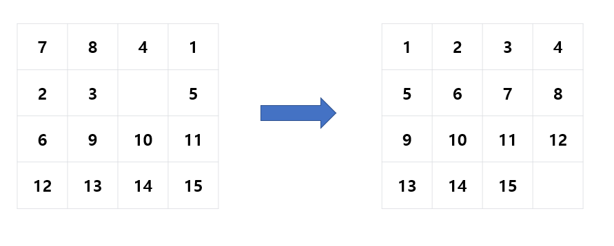
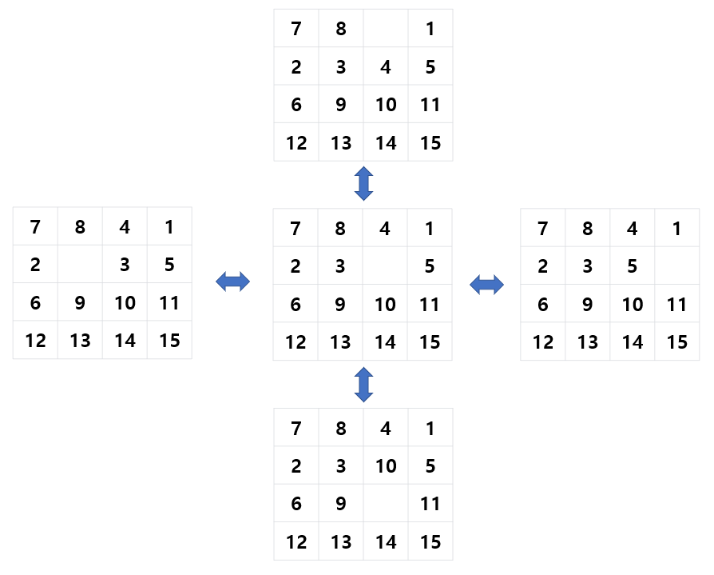
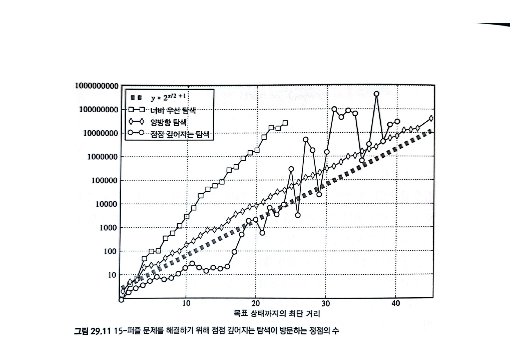

# 29장 그래프의 너비 우선 탐색

## 29.1 도입

- 너비 우선 탐색(Breadth-First Search, BFS)
- 가까운 정점부터 순서대로 방문합니다. 아주 직관적입니다.
- 다익스트라의 최단 경로 알고리즘, 프림의 최소 신장 트리 알고리즘의 기초입니다.

방법


- a를 탐색의 시작점이라고 합시다.
- 우선 a를 방문하고, a와 인접한 정점들을 모두 큐에 넣습니다.
- 그리고 큐에서 꺼낸 정점들을 방문하고, 그것과 인접한 정점들 중 방문하지 않은 것들을 모두 큐에 넣습니다.
- 방문할 수 있는 모든 정점을 방문할 때까지(큐가 빌 때까지) 반복합니다.
- 이렇게 하면 (가중치 그래프가 아니라면) 모든 정점을 a로부터 최단 경로로 방문할 수 있습니다.

큐를 사용하는 이유

- a로부터 더 멀리 떨어진 정점을 먼저 방문하면 안 됩니다.
- 큐는 먼저 넣은, 즉 가까운 정점을 먼저 꺼내는 자료구조이므로 적합합니다.
- DFS에서 흔히 스택을 사용하는 것과 비교됩니다.

```c++
// 그래프의 인접 리스트 표현
vector<vector<int> > adj;
// `start`에서 시작해 그래프를 너비 우선 탐색하고 각 정점의 방문 순서를 반환한다.
vector<int> bfs(int start) {
    // 각 정점의 방문 여부
    vector<bool> discovered(adj.size(), false);
    // 방문할 정점 목록을 유지하는 큐
    queue<int> q;
    // 정점의 방문 순서
    vector<int> order;
    discovered[start] = true;
    q.push(start);
    while (!q.empty()) {
        int here = q.front();
        q.pop();
        // `here`를 방문한다.
        order.push_back(here);
        // 모든 인접한 정점을 검사한다.
        for (int i = 0; i < adj[here].size(); ++i) {
            int there = adj[here][i];
            // 처음 보는 정점이면 방문 목록에 집어넣는다.
            if (!discovered[there]) {
                q.push(there);
                discovered[there] = true;
            }
        }
    }
    return order;
}
```

정점의 발견과 방문

- DFS와는 달리 BFS에서는 정점을 발견했을 때와 방문했을 때의 시점이 다릅니다.
- 정점은 발견되지 않은 상태, 발견되어 방문 대기중인 상태, 방문된 상태의 세 가지 상태를 가집니다.

너비 우선 탐색 스패닝 트리

- DFS와 마찬가지로 BFS에서 새 정점 발견에 사용한 간선들을 모은 트리를 BFS 스패닝 트리라고 합니다.

### 시간 복잡도

- 연결된 모든 정점을 한 번씩 방문해야 합니다.
- 인접한 모든 간선을 검사해야 합니다.
- 인접 리스트 그래프에서 $O(|V| + |E|)$ 입니다.
- 인접 행렬 그래프에서 $O(|V|^2)$ 입니다.

### 최단 거리

- BFS는 대개 두 정점 사이의 최단 경로 문제를 풀 때 사용합니다.
- 가중치가 없는 그래프를 다루고 있으므로, 경유한 간선의 개수를 거리로 삼겠습니다.
- BFS 코드를 살짝만 추가하면 a로부터 모든 정점에 대해 최단 거리를 계산할 수 있습니다.
- 한편 a로부터 다른 모든 정점까지의 최단 경로를 BFS 스패닝 트리에서 찾을 수 있게 됩니다.

증명

- a로부터 각 정점까지의 최단 거리를 distance[]라고 합시다.
- BFS에서 간선 (u, v)를 통해 v를 처음 발견했다고 합시다.
- distance[v] > distance[u] + 1은 불가능합니다. 간선 (u, v)를 통해 방문한 거리인 distance[u] + 1이 더 가깝기 때문입니다.
- distance[v] < distance[u] + 1은 불가능합니다. 이는 v에 u 정점보다 먼저 방문했다는 것인데, v를 처음 발견했다는 가정에 위배됩니다.
- 따라서 distance[v] = distance[u] + 1이 성립합니다.

```c++
// `start`에서 시작해 그래프를 너비 우선 탐색하고 각 정점까지의 최단 거리와 너비 우선 탐색 스패닝 트리를 계산한다.
// distance[i] = start부터 i까지의 최단 거리
// parent[i] = 너비 우선 탐색 스패닝 트리에서 i의 부모의 번호. 루트인 경우 자신의 번호
void bfs2(int start, vector<int>& distance, vector<int>& parent) {
    distance = vector<int>(adj.size(), -1);
    parent = vector<int>(adj.size(), -1);
    // 방문할 정점 목록을 유지하는 큐
    queue<int> q;
    distance[start] = 0;
    parent[start] = start;
    q.push(start);
    while (!q.empty()) {
        int here = q.front();
        q.pop();
        // `here`의 모든 인접한 정점을 검사한다.
        for (int i = 0; i < adj[here].size(); ++i) {
            int there = adj[here][i];
            // 처음 보는 정점이면 방문 목록에 집어넣는다.
            if (distance[there] == -1) {
                q.push(there);
                distance[there] = distance[here] + 1;
                parent[there] = here;
            }
        }
    }
}
```

### 모든 점의 발견

- 거리를 구할 때는 좋습니다.
- DFS에 비해서는 그래프 전체의 구조에 대한 정보를 얻거나, 모든 정점에 대한 검사를 잘 수행하지 못합니다.

## 29.2 문제: Sorting Game (문제 ID: SORTGAME, 난이도: 중)

- 배열의 연속된 일부분을 뒤집는 것을 뒤집기 연산이라고 합시다. {3, 4, 1, 2}에서 {4, 1, 2}를 뒤집으면 {3, 2, 1, 4}가 됩니다.
- 중복이 없는 정수 배열이 주어졌을 때, 뒤집기 연산을 통해 배열을 정렬할 때 필요한 최소 연산 수를 출력하세요.
- 제한사항: 테스트 케이스 수 $C \le 1000$, 매 테스트마다 배열의 길이 $1 \le n \le 8$

### 입력

- 먼저 C가 주어집니다.
- C번에 걸쳐서, 첫줄에 n이 주어지고, 다음줄에 n개의 정수가 띄어쓰기를 사이에 두고 주어집니다.

## 29.3 풀이: Sorting Game

### 그래프로 바꾸기

- n개의 원소를 배열하는 방법은 n!가지입니다.
- 어떤 배열 상태를 정점으로 두고, 그 정점에서 뒤집기 연산 1회로 만들 수 있는 배열 정점들을 간선으로 연결합니다.
- 이렇게 두면 입력된 배열에서 시작해서 정렬된 배열로 가는 최단 거리를 찾는 문제가 됩니다.

```c++
// perm을 정렬하기 위해 필요한 최소 뒤집기 연산의 수를 계산한다.
int bfs(const vector<int>& perm) {
    int n = perm.size();
    // 목표 정점을 미리 계산한다.
    vector<int> sorted = perm;
    sort(sorted.begin(), sorted.end());
    // 방문 목록(큐)과 시작점부터 각 정점까지의 거리
    queue<vector<int> > q;
    map<vector<int>, int> distance;
    // 시작점을 큐에 넣는다.
    distance[perm] = 0;
    q.push(perm);
    while (!q.empty()) {
        vector<int> here = q.front();
        q.pop();
        // 목표 정점을 발견했으면 곧장 종료한다.
        if (here == sorted) return distance[here];
        int cost = distance[here];
        // 가능한 모든 구간을 뒤집어 본다.
        for (int i = 0; i < n; ++i) {
            for (int j = i + 2; j <= n; ++j) {
                reverse(here.begin() + i, here.begin() + j);
                if (distance.count(here) == 0) {
                    distance[here] = cost + 1;
                    q.push(here);
                }
                reverse(here.begin() + i, here.begin() + j);
            }
        }
    }
    // 이 줄에 도달하지 않습니다.
    return -1;
}
```

### 너무 느리다

- 최악의 경우 8! = 40320개의 정점을 1000개의 테스트 케이스에 대해 수행해야 합니다. 높은 확률로 시간초과입니다.
- 자잘한 최적화도 가능하겠지만, 그것보다 더 큰 핵심이 두 가지 있습니다.

1. 숫자들이 다르더라도 상대적인 크기가 같은 배열들에 대한 답은 항상 같습니다. {3, 4, 1, 2}와 {30, 40, 10, 20}은 각 원소들의 상대적인 크기가 같습니다. 따라서 최소 연산 수도 같습니다.
2. 양방향 그래프이므로, 입력 배열에서 정렬된 배열로 가는 경로는 정렬된 배열에서 입력 배열로 가는 경로와 동일합니다.

- 따라서, **정렬된 배열을 시작점으로** 하는 BFS 최단 거리 목록을 처음 한 번만 $n = 1, 2, ..., 8$에 대해 **미리 계산**해두고, 이 8개의 최단 거리 목록을 이용해 모든 테스트 케이스를 해결할 것입니다.
- 그렇게 하면 미리 계산할 때는 최대 40320개의 정점만을 방문하면 되고, 각 테스트 케이스에 대해 해시 맵을 이용해 상수 시간에 답을 계산할 수 있습니다.

```c++
map<vector<int>, int> toSort;
// [0, ..., n-1]의 모든 순열에 대해 toSort[]를 계산해 저장한다.
void precalc(int n) {
    vector<int> perm(n);
    for (int i = 0; i < n; ++i) perm[i] = i;
    // BFS를 위한 큐
    queue<vector<int> > q;
    q.push(perm);
    toSort[perm] = 0;
    while (!q.empty()) {
        vector<int> here = q.front();
        q.pop();
        int cost = toSort[here];
        // 가능한 모든 구간을 뒤집어 본다.
        for (int i = 0; i < n; ++i) {
            for (int j = i + 2; j <= n; ++j) {
                reverse(here.begin() + i, here.begin() + j);
                if (toSort.count(here) == 0) {
                    toSort[here] = cost + 1;
                    q.push(here);
                }
                reverse(here.begin() + i, here.begin() + j);
            }
        }
    }
}

int solve(const vector<int>& perm) {
    // perm의 순열을 [0, ..., n-1]의 순열로 변환한다.
    int n = perm.size();
    vector<int> fixed(n);
    for (int i = 0; i < n; ++i) {
        int smaller = 0;
        for (int j = 0; j < n; ++j)
            if (perm[j] < perm[i])
                ++smaller;
        fixed[i] = smaller;
    }
    // 이 순열의 최소 연산 횟수를 계산한다.
    return toSort[fixed];
}
```

## 29.6 최단 경로 전략

너비 우선 탐색은 대개 (가중치가 없는 그래프의) 최단 경로 문제를 풀 때 사용합니다.

### 예제: 15-퍼즐

- 4x4 타일에 대하여 처음 주어진 상태를 그림의 오른쪽처럼 종료 상태로 바꾸는 문제입니다. 이때
필요한 최소 움직임의 수를 계산해봅시다.



- 우선 게임판의 상태를 정점으로 하는 그래프로 만듭니다.
- 한 번의 움직임으로 한 상태를 다른 상태로 바꿀 수 있으면, 두 정점을 간선으로 연결합니다.



### 1. 너비 우선 탐색(BFS)

```c++
// 게임판의 상태를 표현한다.
class State {
    // 인접한 상태들의 목록을 반환한다.
    vector<State> getAdjacent() const;
    // map에 State를 넣기 위한 비교 연산자
    bool operator < (const State& rhs) const;
    // 종료 상태와 비교하기 위한 연산자
    bool operator == (const State& rhs) const;
};
typedef map<State, int> StateMap;
// start에서 finish까지 가는 최단 경로의 길이를 반환한다.
int bfs(State start, State finish) {
    // 예외: start == finish인 경우
    if (start == finish) return 0;
    // 각 정점까지의 최단 경로의 길이를 저장한다.
    StateMap c;
    // 앞으로 방문할 정점들을 저장한다.
    queue<State> q;
    q.push(start);
    c[start] = 0;
    // 너비 우선 탐색
    while (!q.empty()) {
        State here = q.front();
        q.pop();
        int cost = c[here];
        // 인접한 정점들의 번호를 얻어낸다.
        vector<State> adjacent = here.getAdjacent();
        for (int i = 0; i < adjacent.size(); ++i) {
            if (c.count(adjacent[i]) == 0) {
                if (adjacent[i] == finish)
                    return cost + 1;
                c[adjacent[i]] = cost + 1;
                q.push(adjacent[i]);
            }
        }
    }
    // 답을 찾지 못한 경우
    return -1;
}
```

- 구현이 복잡하지 않습니다.
- 단, $O(b^d)$입니다. 이때 b는 각 상태별 분기 횟수(인접 간선 수), d는 목표 정점까지 최단 거리입니다. 문제에서 d가 24면 2600만개의 정점을 방문해야 합니다.

### 2. 양방향 탐색

- 시작 정점에서 정방향으로 탐색하는 동시에 목표 정점에서 역방향으로 탐색합니다.
- 이 둘이 어딘가에서 만나면 종료합니다.

```c++
// 15-퍼즐 문제의 상태를 표현하는 클래스 (생략)
class State;

// x의 부호를 반환한다.
int sgn(int x) { if (!x) return 0; return x > 0 ? 1 : -1; }
// x의 절대값을 1 증가시킨다.
int incr(int x) { if (x < 0) return x - 1; return x + 1; }
// start에서 finish까지 가는 최단 경로의 길이를 반환한다.
int bidirectional(State start, State finish) {
    // 각 정점까지의 최단 경로의 길이를 저장한다.
    map<State, int> c;
    // 앞으로 방문할 정점들을 저장한다.
    queue<State> q;
    // 시작 상태와 목표 상태가 같은 경우
    if (start == finish) return 0;
    q.push(start); c[start] = 1;
    q.push(finish); c[finish] = -1;
    // 너비 우선 탐색
    while (!q.empty()) {
        State here = q.front();
        q.pop();
        // 인접한 상태들을 검사한다.
        vector<State> adjacent = here.getAdjacent();
        for (int i = 0; i < adjacent.size(); ++i) {
            map<State, int>::iterator it = c.find(adjacent[i]);
            if (it == c.end()) {
                c[adjacent[i]] = incr(c[here]);
                q.push(adjacent[i]);
            }
            // 가운데서 만난 경우
            else if (sgn(it->second) != sgn(c[here]))
                return abs(it->second) + abs(c[here]) - 1;
        }
    }
    // 답을 찾지 못한 경우
    return -1;
}
```

- 일반적인 BFS보다는 안정적입니다.
- 다만 양방향 그래프가 아니거나(혹은 역방향 간선을 찾기 어렵거나), 애초에 최단 거리가 어마어마하게 크다면 사용하기 어렵습니다.

### 3. 점점 깊어지는 탐색 (Iteratively Deepening Search, IDS)

- 임의의 깊이 제한 l을 정한 후 이 제한보다 짧은 경로가 존재하는지 DFS로 확인합니다.
- 답을 찾으면 반환하고, 답을 찾지 못하면 l을 늘려서 다시 시도합니다.

```c++
// 15-퍼즐 문제의 상태를 표현하는 클래스 (생략)
class State;

int best;
// 깊이 우선 탐색
void dfs(State here, const State& finish, int steps) {
    // 지금까지 구한 최적해보다 더 좋을 가능성이 없으면 버린다.
    if (steps >= best) return;
    // 목표 상태에 도달한 경우
    if (here == finish) {
        best = steps;
        return;
    }
    // 인접 상태들을 깊이 우선 탐색으로
    vector<State> adjacent = here.getAdjacent();
    for (int i = 0; i < adjacent.size(); ++i)
        dfs(adjacent[i], finish, steps + 1);
}
// 점점 깊어지는 탐색
int ids(State start, State finish, int growthStep) {
    for (int limit = 4; ; limit += growthStep) {
        best = limit + 1;
        dfs(start, finish, 0);
        if (best <= limit)
            return best;
    }
    return -1;
}
```

- DFS는 대체로 메모리 사용량이 적은 편입니다.
- 대신 깊이 제한을 늘려가면서 DFS를 반복하므로, 정점을 반복적으로 방문하는 낭비가 발생할 수 있습니다.
- 목표 정점까지의 최단 거리를 d, 분기 횟수를 b, 깊이 제한이 1부터 1씩 증가하면 다음과 같습니다.
  $(d+1)*b^0 + d*b^1 + (d-1)b^2 + ... + 2*b^(d-1) + 1*b^d$
- 결국 $O(b^d)$인 건 마찬가지지만, 메모리 사용이 적고 여러 가지치기 기법을 적용하기 쉬워서 더 빠른 경우도 있습니다.

### 성능 비교



### 탐색 방법 선택하기

각 탐색 방법의 장단점을 고려하여 선택해야 합니다.

1. 상태 공간에서의 최단 경로를 찾는 경우, **BFS**를 최우선 고려합니다. 직관적이고 구현도 간단합니다. 다만 탐색의 깊이 한계가 정해져있지 않거나 너무 깊어서 메모리 사용량이 너무 큰지 검토해야 합니다.
2. 상태 공간에서의 최단 경로를 찾는데 탐색의 최대 길이가 정해져있고, BFS하기에 시간이나 공간이 부족하다면 **양방향 탐색**을 활용합시다. 단, 목표상태에서 역방향으로 움직이기 쉬워야 합니다.
3. 위 두 탐색이 모두 메모리를 많이 사용하거나 너무 느린 경우: 최적화를 할 거리가 더 많을 경우, **점점 깊어지는 탐색**을 사용합시다.
